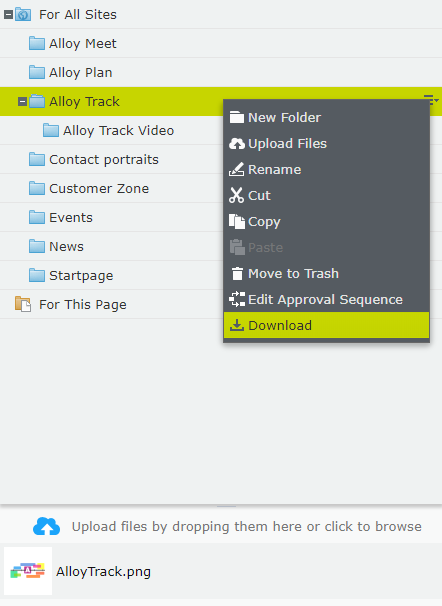
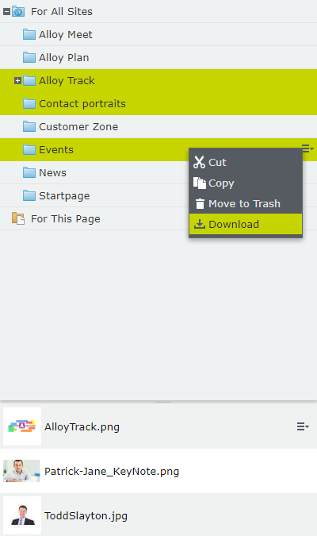

# Assets download

Episerver 11+ extension that allows to download folder with media files as ZIP.

In the context menu of media folders there is new "Download" command.

After running the command all media files from the directory will start to be downloaded as single ZIP file.
If there are nested folders, they also will be included in the output ZIP file.

Editor can select multiple folders and download it as one package.

**caution** | 
------------ | 
Files are zipped in memory stream, so it could work slow for directories with many files | 
